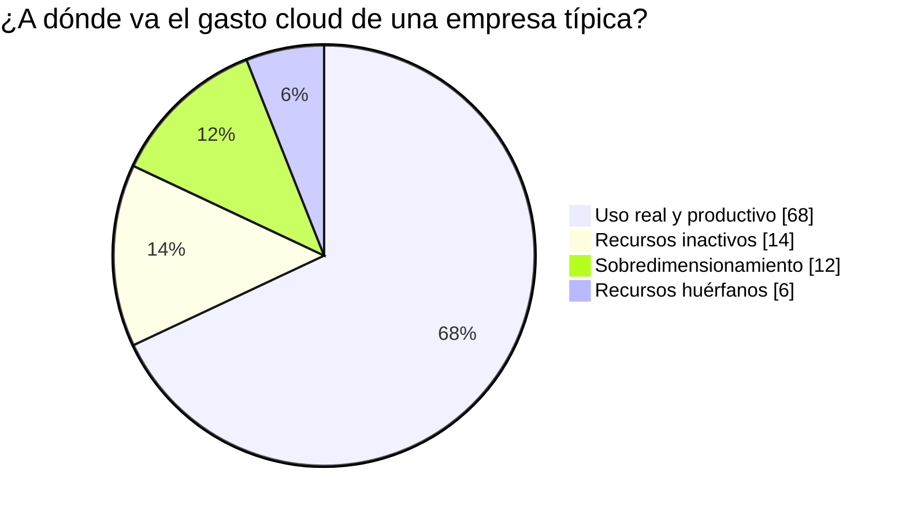
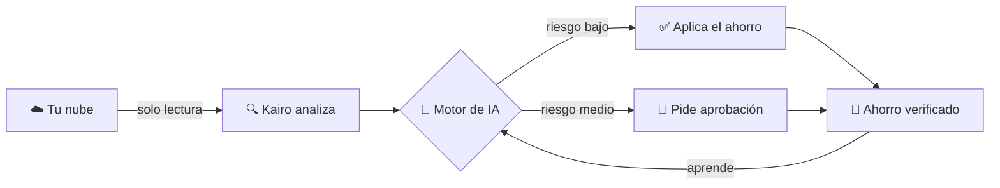
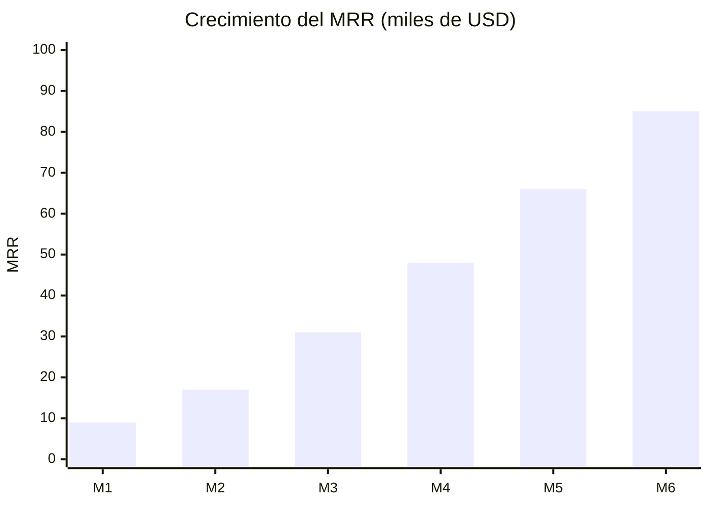
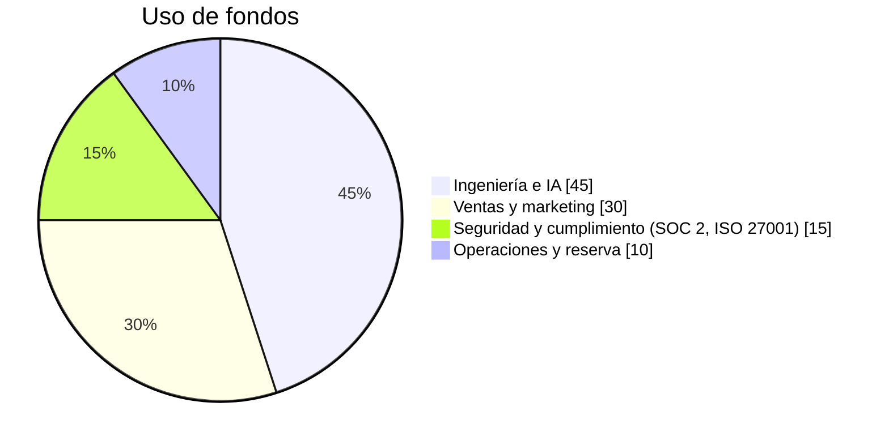
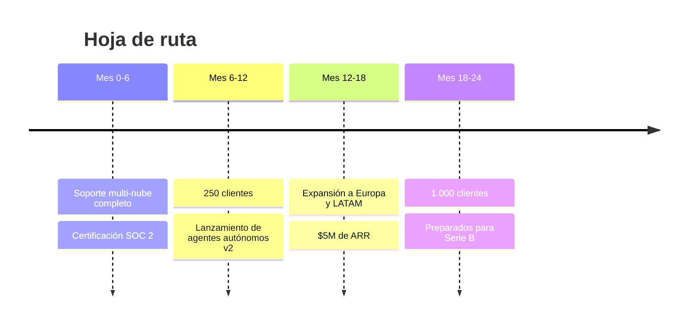

<div align="center">

# ⚡ Kairov2

### La nube de tu empresa gasta de más. Kairo lo arregla solo.

**Un copiloto con IA que reduce la factura cloud entre un 30 % y un 45 %, sin que ningún ingeniero toque nada.**


</div>

> ⏱️ **¿Solo tienes 30 segundos?** Lee la tabla de abajo. Si sigues leyendo, mejor.

| 🔥 Problema | 💡 Solución | 💰 Oportunidad | 🎯 Petición |
|---|---|---|---|
| Las empresas desperdician ~30 % de su gasto cloud | Kairo detecta y corrige el desperdicio automáticamente | Mercado FinOps de decenas de miles de millones de USD | **$10M para pasar de 40 a 1.000 clientes** |

> ⚠️ **Nota:** las cifras de este README son **ilustrativas**. Sustitúyelas por tus datos reales antes de enviarlo.

---

## 😖 El problema: dinero que se evapora cada mes

Cada equipo de ingeniería conoce este ritual:

1. Llega la factura de AWS/Azure/GCP. Es **más alta que la del mes pasado**.
2. Nadie sabe por qué.
3. Se abre un ticket, se hace una hoja de cálculo, se pierde una semana.
4. El mes siguiente, **otra vez**.

Servidores encendidos que nadie usa, discos huérfanos, instancias sobredimensionadas, entornos de pruebas que corren el fin de semana. **Es dinero tirado, y nadie tiene tiempo de recogerlo.**



---

## ✨ La solución: ahorro en piloto automático

Kairo se conecta en modo **solo lectura**, entiende cómo funciona tu infraestructura y propone (o aplica) cambios seguros.



**Tres ideas que nos diferencian:**

- 🛡️ **Seguridad primero:** cada acción tiene *rollback* automático. Si algo falla, se deshace en segundos.
- 🧠 **Entiende el contexto:** no apaga lo que parece inactivo pero es crítico (por ejemplo, un servidor de *failover*).
- 💬 **Habla tu idioma:** pregunta *"¿por qué subió la factura?"* y obtén una respuesta clara, no un gráfico de 40 colores.

---

## 🎬 Míralo funcionar

```text
$ kairo connect --provider aws
✔ Conectado (solo lectura) en 4 min 12 s

$ kairo scan
🔎 Analizados 2.481 recursos en 6 regiones
💸 Ahorro potencial detectado: $18.420 / mes

   Top oportunidades
   ├─ 312 instancias sobredimensionadas ........ $9.100
   ├─ 87 entornos dev encendidos 24/7 ......... $5.300
   └─ 204 discos y snapshots huérfanos ........ $4.020

$ kairo apply --safe
✔ 41 acciones aplicadas · 0 incidencias · rollback listo
```

> 📸 *Aquí va un GIF o captura del dashboard. Una imagen vale más que mil párrafos.*

---

## 📈 Tracción (lo que ya funciona)

| Métrica | Hoy | Hace 6 meses |
|---|---|---|
| Clientes de pago | **40** | 6 |
| Ingreso recurrente mensual (MRR) | **$85K** | $9K |
| Ahorro medio por cliente | **37 %** | 29 % |
| Retención neta de ingresos | **128 %** | 104 % |
| Tiempo hasta el primer ahorro | **< 1 día** | 5 días |



---

## 🌍 Por qué ahora

- 📊 El gasto cloud mundial crece cada año a doble dígito.
- 💼 Los CFO exigen eficiencia: *"hacer más con menos"* es la consigna.
- 🤖 La IA ha vuelto **viable** automatizar decisiones que antes requerían un experto humano.
- 🧩 Las herramientas actuales **solo muestran dashboards**. Kairo **actúa**.

---

## 💵 Modelo de negocio

**Cobramos un porcentaje del ahorro generado.** Si no ahorras, no pagas.

| Plan | Para quién | Precio |
|---|---|---|
| 🌱 **Starter** | Startups | Gratis hasta $5K de ahorro |
| 🚀 **Growth** | Empresas medianas | 15 % del ahorro verificado |
| 🏢 **Enterprise** | Grandes cuentas | Contrato anual + soporte dedicado |

**Economía por cliente (ilustrativa):** CAC $4.200 · LTV $38.000 · recuperación de la inversión en **4 meses**.

---

## 🥊 Competencia

| | Dashboards tradicionales | Consultoras FinOps | **Kairo** |
|---|:---:|:---:|:---:|
| Detecta desperdicio | ✅ | ✅ | ✅ |
| **Corrige automáticamente** | ❌ | ⚠️ manual | ✅ |
| Coste inicial | Medio | Alto | **Cero** |
| Tiempo de implantación | Semanas | Meses | **Minutos** |
| Aprende con el tiempo | ❌ | ❌ | ✅ |

---

## 🎯 Qué haremos con los $10M



**Hitos a 24 meses:**



---

## ⚠️ Riesgos (los decimos nosotros antes que tú)

| Riesgo | Cómo lo mitigamos |
|---|---|
| Los proveedores cloud lanzan herramientas propias | Somos **multi-nube y neutrales**; ellos no tienen incentivo para que gastes menos |
| Miedo a que una IA toque producción | Modo solo lectura por defecto, aprobaciones, rollback automático |
| Ciclos de venta largos en grandes empresas | Entrada *bottom-up* gratuita y cobro por resultados |

---

## 👥 Equipo

| | Rol | Trayectoria |
|---|---|---|
| 👩‍💻 **Nombre Apellido** | CEO | Ex-líder de infraestructura en [Empresa] |
| 👨‍🔬 **Nombre Apellido** | CTO | Doctorado en sistemas distribuidos, 12 años en la nube |
| 👩‍💼 **Nombre Apellido** | COO | Escaló ventas B2B de 0 a $20M en [Empresa] |

---

## 🚀 Pruébalo tú mismo en 5 minutos

```bash
# 1. Instala
curl -fsSL https://kairo.example.com/install.sh | sh

# 2. Conecta tu nube (solo lectura)
kairo connect --provider aws

# 3. Descubre cuánto estás perdiendo
kairo scan
```

📖 [Documentación](./docs) · 🏗️ [Arquitectura](./docs/architecture.md) · 🔐 [Seguridad](./SECURITY.md)

---

<div align="center">

## 🤝 La petición

**$10M · Serie A · 24 meses de runway · objetivo: 1.000 clientes y $15M de ARR**

Cada mes que pasa, miles de empresas pierden millones en la nube.
**Ayúdanos a recuperarlo.**

📧 **contacto@kairo.example.com** · 📅 [Agenda una demo de 20 min](https://kairo.example.com/demo)

</div>
